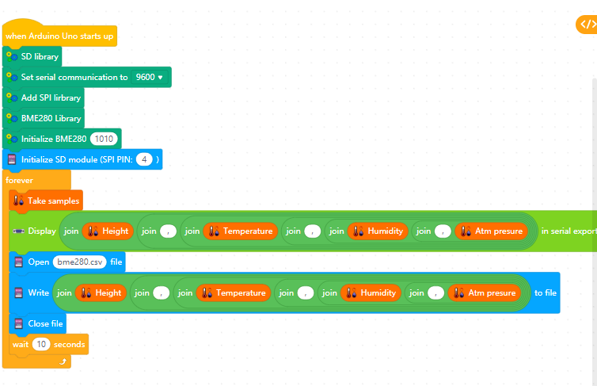

<!DOCTYPE html PUBLIC "-//W3C//DTD XHTML 1.0 Strict//EN" "http://www.w3.org/TR/xhtml1/DTD/xhtml1-strict.dtd">
<html xmlns="http://www.w3.org/1999/xhtml" xml:lang="en" lang="en"><head>

  
  <meta http-equiv="content-type" content="text/html;charset=utf-8" />

  
  <meta name="generator" content="Geany 1.32" /></head><body>

 

&nbsp; 

<pre style="font-family: Courier New,Courier,monospace;">	<h1 style="text-align: center;">Ανάλυση ατμοσφαιρικής ρύπανσης</h1><h1 style="text-align: center;">με δειγματοληπτικό έλεγχο</h1><h1 style="text-align: center;">(The Airbot project)</h1><h3><big>Σενάριο δραστηριότητας</big></h3>Αριθμός μαθητών: 9 Αριθμός Ομάδων: 3 Αριθμός ατόμων ανά ομάδα: 3 Είδος  δραστηριότητας: Ομαδοσυνεργατική Ρόλοι: Δεν υπάρχουν διακριτοί ρόλοι στην ομάδα. Ηλικιακή ομάδα: 12-15  <h3><big>Φάση προετοιμασίας</big></h3>Οι μαθητές θα πρέπει να:      • Διερευνήσουν στο διαδίκτυο και να ανακαλύψουν τους ρύπους της ατμόσφαιρας.     • Συντάξουν ένα έντυπο όπου θα περιγράφουν τους σημαντικότερους ατμοσφαιρικούς ρύπους.     • Να αναζητήσουν στο διαδίκτυο πληροφορίες για τους αισθητήρες που θα χρησιμοποιήσουμε.  <h3><big>Φάση σχεδιασμού</big></h3>Οι μαθητές θα πρέπει να:      • Να αναζητήσουν στο διαδίκτυο πληροφορίες για τη συνδεσμολογία των αισθητήρων με το Arduino.     • Να αναζητήσουν στο διαδίκτυο πληροφορίες για τις προδιαγραφές των αισθητήρων.     • Να δημιουργήσουν στο Fritzing τις παραπάνω συνδεσμολογίες.   <h3><big>Φάση υλοποίησης</big></h3>Οι μαθητές θα πρέπει να:     • Δημιουργήσουν τις φυσικές συνδέσεις των υλικών τους με τους αισθητήρες.     • Να προγραμματίσουν το Arduino χρησιμοποιώντας το περιβάλλον Mblock έτσι ώστε να παίρνουν τιμές από τους αισθητήρες.  <h3><big>Φάση Δοκιμών</big></h3>Οι μαθητές θα πρέπει να:     • Δοκιμάσουν τον εξοπλισμό τους και να επιβεβαιώσουν τη σωστή λειτουργία του.   <h3><big>Υλικά</big></h3><table style="width: 100%;" border="1">
  <tbody><tr>
    <th>ΠΟΣΟΤΗΤΑ</th>
    <th>ΕΙΔΟΣ</th>
    <th>ΚΟΣΤΟΣ</th>
    <th>Σχόλια</th>
  </tr>
  <tr align="center">
    <td>3</td>
    <td>ARDUINO UNO</td>
    <td>75</td>
    <td>Θα δημιουργηθούν 4 διαφορετικά υποσυστήματα</td>
  </tr>
  <tr align="center">
    <td>1</td>
    <td>Waveshare Environmental Sensor - BME280</td>
    <td>10</td>
    <th> </th>
  </tr>
  <tr align="center">
    <td>1</td>
    <td>CCS811 Air Quality Sensor Breakout - VOC &amp; eCO2</td>
    <td>25</td>
    <th> </th>
  </tr>
  <tr align="center">
    <td>1</td>
    <td>Waveshare Dust Sensor</td>
    <td>16</td>
    <th> </th>
  </tr>
  <tr align="center">
    <td>2</td>
    <td>Μετεωρολογικά μπαλόνια</td>
    <td>13</td>
    <th> </th>
  </tr>
  <tr align="center">
    <td>3</td>
    <td>Waveshare Micro SD Storage Board</td>
    <td>14,7</td>
    <th> </th>
  </tr>
  <tr align="center">
    <td> </td>
    <td>Σύνολο</td>
    <td>153,7</td>
    <th> </th>
  </tr>
</tbody></table>  <h3><big>Αναλυτική περιγραφή</big></h3>Οι μαθητές αφού ασχοληθούν με τους παράγοντες που δημιουργούν την ατμοσφαιρική ρύπανση, θα δημιουργήσουν ένα σταθμό μέτρησης της ατμοσφαιρικής ρύπανσης. Το σύστημα θα αποτελείτε από τρία επιμέρους υποσυστήματα, τα οποία θα έχουν κατανεμηθεί, 1 σε κάθε ομάδα, για υλοποίηση.  Τα συστήματα αυτά θα τοποθετηθούν σε μετεωρολογικά μπαλόνια, όπου θα είναι δεμένα με σπάγκο και θα ανέβουν σε περίπου 100 – 200 μέτρα έτσι ώστε να αρχίσουν να παίρνουν μετρήσεις.  Αυτή η διαδικασία θα γίνει σε 3 διαφορετικές περιοχές.      1. Περιοχή με καμένα δέντρα     2. Στο κέντρο της πόλης     3. Περιοχή κατάμεστη από πράσινο σε μεγάλο ύψος Οι μετρήσεις θα μελετηθούν από τους μαθητές και θα βγουν τα αντίστοιχα συμπεράσματα.  </pre>

<h4><big><big><big>Πλατφόρμες που
χρησιμοποιήθηκαν </big></big></big></h4>

 
Όλα τα διαδυκτιακά εργαλεία που χρησιμοποιήσαμε ανοίκουν στο Πανελληνιο
σχολικό δίκτυο. 
Δημιουργήθηκαν λογαριασμοί μαθητών για να μπορέσουν να συνδέονται στο
Πανελληνιο σχολικό δίκτυο. 
 

<small><small>
<small><small><b>Πλατφόρμες
εργασίας</b></small></small></small></small>

<dl>
  <dt><small><small><small><small><b>Ηλεκτρονική
τάξη:</b> https://eclass.sch.gr</small></small></small></small></dt>
  <dt><small><small><small><small><b>Πλατφόρμα
τηλεδιασκέψεων:</b> https://meeting.sch.gr</small></small></small></small></dt>
  <dt><small><small><small><small><b>Ομαδοσυνεργατικά
έγγραφα:</b> https://grafis.sch.gr</small></small></small></small></dt>
  <dt><small><small><small><small><b>Ηλεκτρονικό
ταχυδρομείο:</b> https://webmail.sch.gr</small></small></small></small></dt>
  <dt><small><small><small><small><b>Υπηρεσία
Επικοινωνίας:</b></small></small><small><small> </small></small><small><small>https://www.uc.sch.gr</small></small></small></small></dt>
</dl>
 

<h4><big style="font-weight: bold;"><big><big>Εργαλεία ΕΛΛΑΚ που
χρησιμοποιήθηκαν</big></big></big></h4>

<ul>
  <li>Libreoffice</li>
  <li>Mblock</li>
  <li>Arduino IDE</li>
  <li>Fritzing</li>
</ul>

<h3><big style="font-family: Times New Roman,Times,serif;"><big>Θα χρειαστεί να μεταφορτώσετε</big></big> 
</h3>
<h3 style="text-align: left; font-family: Times New Roman,Times,serif;">1) <a href="/libs-extensions/The%20airbot%20extension%20mblock%20Ver%201.mext">Τα blocks που δημιούργησε ο εκπαιδευτικός πληροφορικής για τον ευκολότερο προγραμματισμό σε mblock.</a> 
</h3>
<h3 style="text-align: left;">2) <a href="/libs-extensions/arduino%20ide%20libraries.zip">Τις βιβλιοθήκες που θα χρησιμοποιήσουμε στο Arduino IDE.</a> 
</h3>
<h3><big style="font-weight: bold;"><big><big>Θεωρητικό μέρος</big></big></big></h3>

<h3 style="text-decoration: underline;">Τι
είναι η ατμοσφαιρική ρύπανση</h3>
Ατμοσφαιρική ρύπανση είναι η ρύπανση της ατμόσφαιρας , δηλαδή η
προσθήκη ουσιών ( ρυπών ) στην ατμόσφαιρα που υπό φυσιολογικές συνθήκες
δεν θα υπήρχαν . Στη σύγχρονη εποχή ,συχνά η ρύπανση είναι αποτέλεσμα
της ανθρώπινης δραστηριότητας .
<h4 style="text-decoration: underline;">Κύριες
πηγές εκπομπής ατμοσφαιρικών ρύπων</h4>
<ul>
  <li>Η ατμοσφαιρική ρύπανση
δημιουργείται από </li>
  <li>Τα μεταφορικά μέσα (αυτοκίνητα, λεωφορία, αεροπλάνα,
μηχανάκια, φορτηγά)</li>
  <li>Τα νοικοκυριά</li>
  <li>Το ηλεκτρικό ρεύμα</li>
  <li>Την βιομηχανία </li>
  <li>Απορρυπαντικά, σπρέι</li>
  <li>Εργοστάσια καίγοντας
λιγνίτη και ορυκτά παράγουν καυσαέρια ρυπαίνοντας έτσι την ατμόσφαιρα.</li>
  <li>κ.ά.</li>
</ul>

<h1 style="text-decoration: underline;">Βασικοί
ατμοσφαιρικοί ρύποι</h1>
Υπάρχουν 6 κύριοι ατμοσφαιρικοί ρύποι: 
 
<ul>
  <li>Οξείδια του αζώτου:με τον
όρο οξείδια του αζώτου ορίζονται οι ενώσεις του αζώτου με το οξυγόνο σε
διάφορες αναλογίες </li>
  <li>Μονοξείδιο του άνθρακα:το
μονοξείδιο του άνθρακα είναι ένα από τα
οξείδια του άνθρακα και παράγεται από την μερική καύση του άνθρακα.</li>
  <li>Διοξείδιο του θείου:το
διοξείδιο του θείου ανήκει στην οικογένεια των
σουλφιδίων , αέρια των οποίο κύριο χαρακτηριστικό είναι ότι είναι
διαλυτά στο νερό</li>
  <li>Όζον:με τον όρο όζον
ορίζουμε το τριατομικό οξυγόνο , αέριο που κατά
κύριο λόγο εκλύεται στην ατμόσφαιρα&nbsp; ως παράγωγο χημικών
αντιδράσεων
μέσα στην ίδια την ατμόσφαιρα&nbsp; </li>
  <li>Μόλυβδος:ο μόλυβδος είναι
μέταλλο που συναντάται τόσο στο φυσικό
περιβάλλον όσο και στα προιόντα ή τα κατάλοιπα της βιομηχανικής
παραγωγής&nbsp; </li>
  <li>Αιωρούμενα σωματίδια: ο
όρος σωματίδιο περιγράφει τα διάφορα σωματίδια που βρίσκονται στην
ατμόσφαιρα</li>
  <li>Το όζον (χημικός τύπος: Ο3:
είναι ένα ανοιχτό μπλε αέριο με χαρακτηριστική πικάντικη οσμή. Είναι
ένα αλλοτρόπιο οξυγόνο που είναι πολύ λιγότερο σταθερό από το διατομικό
αλλοτρόπιο Ο2, διασπώντας στην χαμηλότερη ατμόσφαιρα σε 02 ή διοξείδιο.
Το όζον σχηματίζεται από διοξείδιο με τη δράση υπεριώδους φωτός (UV)
και ηλεκτρικών εκκενώσεων εντός της ατμόσφαιρας της Γης. Παρουσιάζεται
σε πολύ χαμηλές συγκεντρώσεις καθ 'όλη τη διάρκεια της τελευταίας, με
την υψηλότερη συγκέντρωση να είναι υψηλή στο στρώμα όζοντος της
στρατόσφαιρας, η οποία απορροφά το μεγαλύτερο μέρος της υπεριώδους (UV)
ακτινοβολίας του Ήλιου. 
     
Η οσμή του όζοντος θυμίζει χλώριο και είναι ανιχνεύσιμη από πολλούς
ανθρώπους σε συγκεντρώσεις μόλις 0,1 ppm στον αέρα. Η δομή του Ο3 του
όζοντος προσδιορίστηκε το 1865. Το μόριο αργότερα αποδείχθηκε ότι έχει
μια κυρτή δομή και είναι διαμαγνητική. Σε κανονικές συνθήκες, το όζον
είναι ένα ανοιχτό μπλε αέριο που συμπυκνώνεται σε προοδευτικά
κρυογονικές θερμοκρασίες σε ένα σκούρο μπλε υγρό και τελικά ένα
ιώδες-μαύρο στερεό. Η αστάθεια του όζοντος σε σχέση με το πιο κοινό
διοξυγόνο είναι τέτοια που το συμπυκνωμένο αέριο και το υγρό όζον
μπορούν να αποσυντεθούν εκρηκτικά σε υψηλές θερμοκρασίες ή με γρήγορη
θέρμανση στο σημείο βρασμού. Συνεπώς χρησιμοποιείται εμπορικά μόνο σε
χαμηλές συγκεντρώσεις. 
     
Το όζον είναι ένα ισχυρό οξειδωτικό (πολύ περισσότερο από το διοξείδιο)
και έχει πολλές βιομηχανικές και καταναλωτικές εφαρμογές που
σχετίζονται με την οξείδωση. Ωστόσο, το ίδιο υψηλό οξειδωτικό δυναμικό
προκαλεί τη βλάβη του όζοντος στους βλεννογόνους και αναπνευστικούς
ιστούς στα ζώα και επίσης στους ιστούς σε φυτά, πάνω από τις
συγκεντρώσεις περίπου 100 ppb. Ενώ αυτό κάνει το όζον έναν ισχυρό
αναπνευστικό κίνδυνο και ρύπο κοντά στο έδαφος, μια υψηλότερη
συγκέντρωση στη στιβάδα του όζοντος (από δύο έως οκτώ ppm) είναι
ευεργετική, εμποδίζοντας το φθορό UV φως να φθάσει στην επιφάνεια της
Γης. 
  </li>

</ul>
 
<h1 style="text-decoration: underline;">Κύριες
επιπτώσεις των βασικών ατμοσφαιρικών
ρύπων</h1>
Επιπτώσεις στην
υγεία 
 
Οι ατμοσφαιρικοί ρύποι προκαλούν πρόωρους θανάτους, λόγω λοιμώξεων του
αναπνευστικού, ιδιαίτερα σε παιδιά. 
 
<ul>
  <li>Τα οξείδια του αζώτου που μπορεί να προκαλέσουν καρκινογένεση
μέσω των ελευθέρων ριζών, της δημιουργίας φλεγμονών και των βιολογικών
μεταλλάξεων.</li>
  <li>Το διοξείδιο του θείου που μπορεί να προκαλέσει προβλήματα στην
καρδιά και στους πνεύμονες.</li>
  <li>Το μονοξείδιο του άνθρακα που μπορεί να έχει επιπτώσεις στο αίμα,
στον εγκέφαλο και στην καρδιά. 
Επιπλέον, το πολύ μονοξείδιο του άνθρακα ζαλίζει, προκαλεί πονοκέφαλο
και κούραση.</li>
  <li>Το όζον παρόλο που όταν δεν βρίσκεται στην τροπόσφαιρα (το στρώμα
της ατμόσφαιρας στο οποίο ζούμε) μας προστατεύει, όταν βρίσκεται στην
τροπόσφαιρα, μπορεί να προκαλέσει ερεθισμούς στο αναπνευστικό σύστημα,
στα μάτια, στη μύτη, στον λαιμό και δυσλειτουργία στους πνεύμονες .</li>
  <li>Το βενζόλιο προκαλεί καρκίνο και βλάβες στο νευρικό σύστημα.</li>
</ul>
&nbsp;&nbsp; 
Επιπτώσεις στο
περιβάλλον 
 
<ul>
  <li>Το διοξείδιο του θείου προκαλεί μετά από μακροχρόνια έκθεση όξινη
απόθεση, που είναι επικίνδυνο για οικοσυστήματα.</li>
  <li>Από ατμοσφαιρικούς ρύπους που εκλύονται από την ατελή καύση,
προκαλείται το φαινόμενο του Θερμοκηπίου δηλαδή υπερθέρμανση της γης
που έχει ως αποτέλεσμα να λιώνουν οι πάγοι και να κινδυνεύουν πολλά ζώα.</li>
  <li>Προκαλείται όξινη βροχή που προσβάλλει τα δάση και
&nbsp;μετατρέπει &nbsp;το μάρμαρο σε &nbsp;γύψο.</li>
  <li>Η τρύπα του όζοντος προκαλείται από τη χρήση χλωροφθορανθράκων
που υπάρχουν στα ψυκτικά και στα σπρέι.</li>
  <li>Τα οξείδια του αζώτου, προκαλούν το φωτοχημικό νέφος στις
μεγαλουπολεις</li>
</ul>

<h1>
</h1><h1 style="text-decoration: underline;"><big><big><big><big>Ποιοί
αισθητήρες θα χρησιμοποιηθούν;</big></big></big></big></h1>

<h2><small><small><big><big><big>BME 280</big></big></big></small></small></h2>
<h2>
</h2>

Γενικές πληροφορίες 
Σύνδεση με το Arduino

Ο
αισθητήρας BME280 και κατασκευάζεται από τη BOSCH. Χρησιμοποιείται
εύκολα διότι δεν χρειάζεται επιπλέον εξαρτήματα για να λειτουργήσει.
Μπορεί να μετρήσει με ακρίβεια 

<ul>
  <li>υψόμετρο</li>
  <li>βαρομετρική
πίεση ( πίεση της ατμόσφαιρας στη γη)</li>
  <li>υγρασία
(0% εώς 100%)
    
    </li>
  <li>θερμοκρασία
(από -400C
εώς 85οC)
.</li>
</ul>

<h1 style="text-decoration: underline;">Τρόπος
σύνδεσης με το Arduino (εικόνα απο το
Fritzing)</h1>
 
 
<h1 style="text-decoration: underline;">Το πρόγραμμα στο mblock</h1>

 

<h2>

<big><big>Dust Sensor
(GP2Y1010AU0F | GP2Y1014AU0F )</big></big>

 
<big><big></big></big>

</h2>

<big>Το GP2Y1010AU0F
της Sharp είναι ένας αισθητήρας οπτικής ποιότητας της ατμόσφαιρας,
σχεδιασμένος να ανιχνεύει σωματίδια σκόνης. Μια δίοδος εκπομπής
υπέρυθρης ακτινοβολίας και φωτοτρανζίστορ τοποθετούνται διαγώνια σε
αυτήν τη συσκευή, ώστε να επιτρέπει την ανίχνευση του ανακλώμενου φωτός
της σκόνης στον αέρα. Είναι ιδιαίτερα αποτελεσματικό στην ανίχνευση
πολύ λεπτών σωματιδίων όπως ο καπνός τσιγάρων και χρησιμοποιείται
συνήθως στα συστήματα καθαρισμού του αέρα.</big>

Ο αισθητήρας έχει
πολύ χαμηλή κατανάλωση ρεύματος (μέγιστο 20mA, τυπικό 11mA) και μπορεί
να τροφοδοτηθεί με έως 7VDC. Η έξοδος του αισθητήρα είναι μια αναλογική
τάση ανάλογη προς τη μετρούμενη πυκνότητα σκόνης, με ευαισθησία 0.5V /
0.1mg / m3.<big><big><small><small></small></small></big></big>

<big><big>ΧΑΡΑΚΤΗΡΙΣΤΙΚΑ</big></big> 
<big>Τύπος Αισθητήρα: Σκόνης 
Τυπική Τάση Εισόδου: 7VDC 
Ρεύμα Λειτουργίας: 20mA 
Διασύνδεση: Αναλογική 
Πρωτόκολλο Eπικοινωνίας: Χωρίς</big> 

<big><big></big></big>

<h1 style="text-decoration: underline;">Τρόπος
σύνδεσης με το Arduino (εικόνα απο το
Fritzing)</h1>

 

<h2>
</h2>
<h1 style="text-decoration: underline;">Το πρόγραμμα στο mblock</h1>

<h1 style="text-decoration: underline;"> 
</h1>
<h1 style="text-decoration: underline;"><small><small>Adafruit CCS811
Air Quality Sensor</small></small></h1>

<big>Αυτός ο
αισθητήρας είναι ένας αισθητήρας αερίων που μπορεί να
ανιχνεύσει ένα ευρύ φάσμα πτητικών οργανικών ενώσεων (VOCs) και
προορίζεται για την παρακολούθηση της ποιότητας του αέρα. Υπάρχει
επίσης ένα θερμίστορ που μπορεί να χρησιμοποιηθεί για τον υπολογισμό
της τοπικής
θερμοκρασίας περιβάλλοντος. 
Το CCS811
διαθέτει έναν «τυπικό» αισθητήρα MOX θερμής πλάκας, καθώς και έναν
μικρό μικροελεγκτή που ελέγχει την ισχύ στην πλάκα, διαβάζει την
αναλογική τάση και παρέχει μια διασύνδεση I2C από την οποία διαβάζεται.Το μέρος
αυτό θα μετρήσει τη συγκέντρωση CO2) σε μια περιοχή από 400 έως
8192 μέρη ανά εκατομμύριο (ppm) και η συγκέντρωση TVOC (Total Volatile
Organic Compound) εντός εύρους από 0 έως 1187 μέρη ανά δισεκατομμύριο
(ppb). Επίσης, η AMS συνιστά να τρέχετε αυτόν τον αισθητήρα για 48
ώρες, όταν τον παραλάβετε για να το "στρώσετε", και στη συνέχεια 20 λεπτά
επιθυμητή λειτουργία κάθε φορά που χρησιμοποιείται ο αισθητήρας. Αυτό
συμβαίνει επειδή τα επίπεδα ευαισθησίας του αισθητήρα θα αλλάξουν κατά
την πρώιμη χρήση.  
</big><big></big><big> 
</big><big><big>ΧΑΡΑΚΤΗΡΙΣΤΙΚΑ</big> <small>
Τύπος Αισθητήρα: Αερίων 

Τυπική Τάση Εισόδου:3.3VDC - 5VDC 

Ρεύμα Λειτουργίας: 30mA 

Διασύνδεση:Ψηφιακή 

Πρωτόκολλο Eπικοινωνίας: I2C</small></big><big> 
</big>
<h1 style="text-decoration: underline;">Τρόπος
σύνδεσης με το Arduino 
</h1>
 

 
 
 

<h1 style="text-decoration: underline;">Το πρόγραμμα στο mblock</h1>

 

 
<h1 style="text-decoration: underline;"><big>MQ 131</big></h1>
<h1></h1>
 
Συμπαγής πλακέτα με βάση τον αισθητήρα MQ-131. Εξοπλισμένο με υψηλή
ευαισθησία και πολύ γρήγορο χρόνο απόκρισης, αυτός ο αισθητήρας είναι
σε θέση να ανιχνεύσει τη συγκέντρωση του όζοντος (10 ~ 1000ppb) στον
αέρα του περιβάλλοντος. Το ευαίσθητο υλικό του αισθητήρα είναι το
διοξείδιο του κασσίτερου (SnO2), το οποίο έχει χαμηλή αγωγιμότητα, όταν
ο αέρας είναι καθαρός στο περιβάλλον, ενώ είναι υψηλότερος παρουσία
όζοντος. 
 
Η πλακέτα έχει ένα trimmer για να ρυθμίσετε την τιμή κατωφλίου, την
αναλογική έξοδο και την ψηφιακή έξοδο (TTL), την κατάσταση LED για την
παροχή ρεύματος και το σήμα εξόδου. 
 
Η ψηφιακή έξοδος μπορεί να συνδεθεί απευθείας με μικροελεγκτή. Η
αναλογική έξοδος παρέχει τάση (0-5 VDC) που αυξάνεται με την αύξηση της
συγκέντρωσης του όζοντος στον αέρα. 
 
Τροφοδοσία: 5 VDC, διαστάσεις (mm): 31,85x19,65x33. Μπορεί να χρησιμοποιηθεί με Arduino ή άλλο μικροελεγκτή. 
 
 
<big><big>ΧΑΡΑΚΤΗΡΙΣΤΙΚΑ</big></big> 

 
 

<table style="border-collapse: collapse; border-spacing: 2px; max-width: 100%; background-color: transparent; width: 815px; margin-bottom: 16px; color: rgb(51, 51, 51); font-size: 13px; font-style: normal; font-weight: 400; letter-spacing: normal; orphans: 2; text-align: start; text-indent: 0px; text-transform: none; white-space: normal; widows: 2; word-spacing: 0px;">
<tbody style=""><tr style=""><td class="span-7 col-md-4 last" style="padding: 7px; position: static; min-height: 1px; float: none; width: 262px; display: table-cell; line-height: 17px;"><label id="param_2193" style="margin: 0px 0px 0px 5px; font-weight: 400;">Τύπος αισθητήρα</label></td><td class="span-10 col-md-8 last" style="padding: 7px; position: static; min-height: 1px; float: none; width: 521px; display: table-cell; line-height: 17px;">αερίου</td></tr><tr class="odd" style="background: rgb(247, 248, 249) none repeat scroll 0% 50% ! important; -moz-background-clip: -moz-initial ! important; -moz-background-origin: -moz-initial ! important; -moz-background-inline-policy: -moz-initial ! important;"><td class="span-7 col-md-4 last" style="padding: 7px; position: static; min-height: 1px; float: none; width: 262px; display: table-cell; line-height: 17px;"><label id="param_1404" style="margin: 0px 0px 0px 5px; font-weight: 400;">Ανιχνευμένο αέριο</label></td><td class="span-10 col-md-8 last" style="padding: 7px; position: static; min-height: 1px; float: none; width: 521px; display: table-cell; line-height: 17px;">O3</td></tr><tr style=""><td class="span-7 col-md-4 last" style="padding: 7px; position: static; min-height: 1px; float: none; width: 262px; display: table-cell; line-height: 17px;"><label id="param_1397" style="margin: 0px 0px 0px 5px; font-weight: 400;">Εύρος μετρήσεων</label></td><td class="span-10 col-md-8 last" style="padding: 7px; position: static; min-height: 1px; float: none; width: 521px; display: table-cell; line-height: 17px;">10...1000ppm</td></tr><tr class="odd" style="background: rgb(247, 248, 249) none repeat scroll 0% 50% ! important; -moz-background-clip: -moz-initial ! important; -moz-background-origin: -moz-initial ! important; -moz-background-inline-policy: -moz-initial ! important;"><td class="span-7 col-md-4 last" style="padding: 7px; position: static; min-height: 1px; float: none; width: 262px; display: table-cell; line-height: 17px;"><label id="param_2390" style="margin: 0px 0px 0px 5px; font-weight: 400;">Σειρά</label></td><td class="span-10 col-md-8 last" style="padding: 7px; position: static; min-height: 1px; float: none; width: 521px; display: table-cell; line-height: 17px;">MQ-131</td></tr></tbody>
</table>
 

<h1 style="text-decoration: underline;">Τρόπος
σύνδεσης με το Arduino </h1>
 

 
 

<h1 style="text-decoration: underline;">Το πρόγραμμα στο mblock 
</h1>
 
 
<h1 style="text-decoration: underline;">Πώς
θα αποθηκεύσουμε τα δεδομένα;</h1>Τα
δεδομένα θα τα αποθηκεύσουμε χρησιμοποιόντας ένα sd module σε κάθε
arduino.Ο τρόπος σύνδεσης με το arduino παρουσιάζεται παρακάτω. Αφού συγκεντρώσουμε τα στοιχεία απο όλες τις κάρτες
sd θα τα επεξεργαστούμε συγκεντρωτικά. 
 

<h1 style="text-decoration: underline;">Τρόπος
σύνδεσης με το Arduino (εικόνα απο το
Fritzing)</h1> 
 

<h2><small><small><big><big><big><small><small><big><big><big>Φωτογραφίες 
</big></big></big></small></small></big></big></big></small></small></h2>

<h1 style="text-decoration: underline;">Η διαδικασία κατασκευής και προγραμματισμού 
</h1>
 
 
<table style="text-align: left; width: 100%;" border="1" cellpadding="2" cellspacing="2">
  <tbody>
    <tr>
      <td style="vertical-align: top;"></td>
      <td style="vertical-align: top;"></td>
      <td style="vertical-align: top;"></td>
    </tr>
    <tr>
      <td style="vertical-align: top;"></td>
      <td style="vertical-align: top;"></td>
      <td style="vertical-align: top;"></td>
    </tr>
    <tr>
      <td style="vertical-align: top;"></td>
      <td style="vertical-align: top;"></td>
      <td style="vertical-align: top;"></td>
    </tr>
    <tr>
      <td style="vertical-align: top;"></td>
      <td style="vertical-align: top;"></td>
      <td style="vertical-align: top;"></td>
    </tr>
    <tr>
      <td style="vertical-align: top;"></td>
      <td style="vertical-align: top;"></td>
      <td style="vertical-align: top;"></td>
    </tr>
    <tr>
      <td style="vertical-align: top;"></td>
      <td style="vertical-align: top;"></td>
      <td style="vertical-align: top;"></td>
    </tr>
    <tr>
      <td style="vertical-align: top;"></td>
      <td style="vertical-align: top;"></td>
      <td style="vertical-align: top;"></td>
    </tr>
    <tr>
      <td style="vertical-align: top;"></td>
      <td style="vertical-align: top;"></td>
      <td style="vertical-align: top;"></td>
    </tr>
    <tr>
      <td style="vertical-align: top;">
      </td>
      <td style="vertical-align: top;">
      </td>
      <td style="vertical-align: top;">
      </td>
    </tr>
    <tr>
      <td style="vertical-align: top;">
      </td>
      <td style="vertical-align: top;">
      </td>
      <td style="vertical-align: top;">
      </td>
    </tr>
  </tbody>
</table>
 

<h1 style="text-decoration: underline;">Η τελική κατασκευή</h1>

<table style="text-align: left; width: 100%;" border="1" cellpadding="2" cellspacing="2">
  <tbody>
    <tr>
      <td style="vertical-align: top;">
      </td>
      <td style="vertical-align: top;">
      </td>
      <td style="vertical-align: top;">
      </td>
      
      
    </tr>
    <tr>
      <td style="vertical-align: top;">
      </td>
      <td style="vertical-align: top;">
      </td>
      <td style="vertical-align: top;">
      </td>
      
      
    </tr>
    <tr>
      <td style="vertical-align: top;">
      </td>
      <td style="vertical-align: top;"> 

      </td>
      <td style="vertical-align: top;"> 

      </td>
      
      
    </tr>
  </tbody>
</table>
 
 

<h2><small><small><big><big><big><small><small><big><big><big><small><small><big><big><big><small><small><big><big><big>Μετρήσεις και Αποτελέσματα 
</big></big></big></small></small></big></big></big></small></small></big></big></big></small></small></big></big></big></small></small></h2>
Οι μετρήσεις που θα καταγραφούν μέσα στις κάρτες sd θα αποθηκευτούν σε
ένα αρχείο .csv έτσι ώστε να μπορούμε να τα κάνουμε εισαγωγή με εύκολο
τρόπο στο πρόγραμμα calc του libre office και να δημιουργήσουμε
γραφήματα των μετρήσεων. 
 
<table style="text-align: left; width: 100%;" border="1" cellpadding="2" cellspacing="2">
  <tbody>
    <tr>
      <td style="vertical-align: top; font-weight: bold; text-align: center;">Περιοχή μέτρησης 
      </td>
      <td style="vertical-align: top; font-weight: bold; text-align: center;">Ημ/νια-ώρα 
&nbsp;μέτρησης 
      </td>
      <td style="vertical-align: top; font-weight: bold; text-align: center;">Υψόμετρο 
      </td>
      <td style="vertical-align: top; font-weight: bold; text-align: center;">Θερμοκρασία 
      </td>
      <td style="vertical-align: top; font-weight: bold; text-align: center;">Υγρασία 
      </td>
      <td style="vertical-align: top; font-weight: bold; text-align: center;">Ατμ. πίεση 
      </td>
      <td style="vertical-align: top; font-weight: bold; text-align: center;">Αρχείο csv 
      </td>
      <td style="vertical-align: top; font-weight: bold; text-align: center;">Γράφημα 
      </td>
    </tr>
    <tr>
      <td style="vertical-align: top;"> 
      </td>
      <td style="vertical-align: top;"> 
      </td>
      <td style="vertical-align: top;"> 
      </td>
      <td style="vertical-align: top;"> 
      </td>
      <td style="vertical-align: top;"> 
      </td>
      <td style="vertical-align: top;"> 
      </td>
      <td style="vertical-align: top;"> 
      </td>
      <td style="vertical-align: top;"> 
      </td>
    </tr>
    <tr>
      <td style="vertical-align: top;"> 
      </td>
      <td style="vertical-align: top;"> 
      </td>
      <td style="vertical-align: top;"> 
      </td>
      <td style="vertical-align: top;"> 
      </td>
      <td style="vertical-align: top;"> 
      </td>
      <td style="vertical-align: top;"> 
      </td>
      <td style="vertical-align: top;"> 
      </td>
      <td style="vertical-align: top;"> 
      </td>
    </tr>
    <tr>
      <td style="vertical-align: top;"> 
      </td>
      <td style="vertical-align: top;"> 
      </td>
      <td style="vertical-align: top;"> 
      </td>
      <td style="vertical-align: top;"> 
      </td>
      <td style="vertical-align: top;"> 
      </td>
      <td style="vertical-align: top;"> 
      </td>
      <td style="vertical-align: top;"> 
      </td>
      <td style="vertical-align: top;"> 
      </td>
    </tr>
  </tbody>
</table>
 

</body></html>